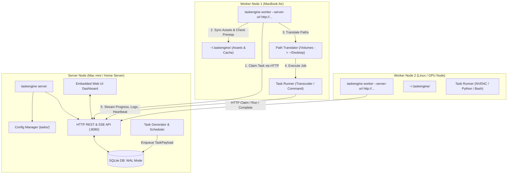

# ⚡ TaskEngine: Distributed Task Orchestration System

`TaskEngine` is a lightweight, distributed task execution system written in Go. It operates as a single binary with dual roles (`server` or `worker`), featuring an open plugin architecture, atomic task claiming via pure-Go SQLite, file-based configuration tracked in git (`tasks/`), task-level prerequisites & asset synchronization, hierarchical configuration inheritance with per-worker path translation, and an embedded reactive Web UI (HTMX + SSE).

---

## 📖 Table of Contents
1. [Architecture & Topology](#-architecture--topology)
2. [Configuration Structure (`tasks/`)](#-configuration-structure-tasks)
3. [Universal Plugin System](#-universal-plugin-system)
   - [Generic Command Runner (`command-runner`)](#1-generic-command-runner-command-runner)
   - [Video Transcoder (`video-transcoder`) for Jellyfin](#2-video-transcoder-video-transcoder)
4. [Task Prerequisites & Git-Synced Assets](#-task-prerequisites--git-synced-assets)
5. [Worker Path Translation](#-worker-path-translation)
6. [Operational Commands Reference](#-operational-commands-reference)
7. [Embedded Web Dashboard](#-embedded-web-dashboard)
8. [Cross-Platform Compilation & Releases](#-cross-platform-compilation--releases)

---

## 📐 Architecture & Topology



### Core Components
* **Dual-Mode Binary**: Runs as `taskengine server` or `taskengine worker`.
* **Database**: Pure-Go SQLite (`modernc.org/sqlite`) running in WAL mode with immediate transactions for atomic task claiming. Zero CGO dependencies.
* **Network & Security Scope**: Lightweight HTTP/SSE communication designed for local LAN, Tailscale, or WireGuard mesh.
* **Dynamic Configuration**: All settings reside in the `tasks/` directory on the server host and can be hot-reloaded without restarting the process.

---

## 📁 Configuration Structure (`tasks/`)

The repository root contains the `tasks/` directory, acting as the single source of truth:

```text
home/
└── tasks/
    ├── config.yaml            # Server runtime settings and global defaults
    ├── workers/               # Per-worker override specifications
    │   ├── laptop1.yaml
    │   └── desktop_gpu.yaml
    ├── definitions/           # Task schedules & definitions
    │   ├── ping.yaml
    │   ├── system_metrics.yaml
    │   └── video_transcode.yaml
    └── assets/                # Task scripts and helper files synced to workers
        └── system-metrics/
            └── gather_metrics.py
```

### 1. Global Settings: `tasks/config.yaml`
```yaml
server:
  port: 8080
  db_path: "data/taskengine.db"
  heartbeat_timeout_seconds: 30
  stale_task_check_interval_seconds: 10

defaults:
  max_concurrent_tasks: 2
  path_mappings:
    "/Volumes/drive001/media": "/Volumes/drive001/media"
  plugin_configs:
    command-runner:
      shell: "/bin/zsh"
    video-transcoder:
      target_codec: "libx264"
      target_height: 1080
      crf: 21
      preset: "medium"
      audio_bitrate: "192k"
```

### 2. Worker Overrides: `tasks/workers/<worker-id>.yaml`
```yaml
worker_id: "laptop1"
max_concurrent_tasks: 2
path_mappings:
  "/Volumes/drive001/media": "/Users/air/Desktop/macmini_media"
plugin_configs:
  video-transcoder:
    target_codec: "h264_videotoolbox"
    ffmpeg_binary: "/opt/homebrew/bin/ffmpeg"
  command-runner:
    shell: "/bin/zsh"
```

---

## 🔌 Universal Plugin System

### 1. Generic Command Runner (`command-runner`)
Executes arbitrary scripts or system commands in any language (Python, Bash, Node.js, Rust, Docker, or CLI binaries) without recompiling the TaskEngine binary.

* **Environment Variables Injected**:
  * `TASK_ID`, `TASK_PLUGIN`, `TASK_NAME`, `TASK_TARGET_FILE`, `TASK_PARAMS_JSON`
  * `TASK_DIR`: Dedicated working directory (`~/.taskengine/tasks/<name>/`)
  * `TASK_ASSETS_DIR`: Path to synced asset files (`~/.taskengine/tasks/<name>/assets/`)
  * `TASK_CACHE_DIR`: Root cache directory (`~/.taskengine/`)
  * `SERVER_URL`, `WORKER_ID`
* **Real-Time Progress Parsing**:
  * Text markers: `PROGRESS: 45%`
  * JSON lines: `{"progress": 45, "speed": "1.8x", "message": "processing"}`
* **Live Log Streaming**: Captures `stdout` and `stderr` line-by-line and streams them over SSE.

### 2. Video Transcoder (`video-transcoder`)
Optimized for **Jellyfin 1080p Universal Direct Play** (100% Direct Play on Web, Mobile, and TV with 0% CPU transcoding on the server):
* **Resolution**: Scaled to 1080p (`scale='min(1920,iw)':-2`).
* **Video Profile**: H.264 High Profile Level 4.1, 8-bit `yuv420p` (`-crf 21 -preset medium`).
* **Audio Profile**: AAC Stereo 2.0 @ 192 kbps (`-c:a aac -b:a 192k -ac 2`).
* **Streaming Optimization**: `-movflags +faststart` for zero-buffer immediate start.
* **Clean In-Place Replacement**: Encodes to `.temp.<base>.mp4`, deletes original, and atomically renames to clean `<base>.mp4` (no `.transcoded` suffix clutter in Jellyfin).
* **Local SSD Scratch Buffering (`scratch_dir`)**:
  * If `scratch_dir` is configured (e.g. `~/.taskengine/scratch`), the worker pulls the source file sequentially to its high-speed local NVMe SSD first.
  * FFmpeg runs with 100% local I/O (zero network latency or HDD seek thrashing).
  * Upon successful transcode, the clean `.mp4` is uploaded back to the media storage, the original file is deleted, `.transcode_cache` is updated, and the local scratch folder is cleaned up.
* **Local Folder State Tracking (`.transcode_cache`)**:
  * Each directory maintains a `.transcode_cache` file listing completed media filenames.
  * State is completely portable and lives with the files. Even if SQLite is reset or media is moved to a new drive, files are never re-encoded.
  * The scanner checks `.transcode_cache` first and skips cached files in $O(1)$ time.

---

## 📦 Task Prerequisites & Git-Synced Assets

Task definitions can declare generic dependency checks and asset files:

```yaml
name: "system-metrics-reporter"
plugin_name: "command-runner"
schedule: "*/10 * * * *"
enabled: true
priority: 5

# 1. Generic Task-Level Prerequisites
# Must exit with code 0 on the worker before the job runs
prerequisites:
  check_command: "which python3 || (echo 'python3 is required' && exit 1)"

# 2. Task-Level Assets Synced to Worker
assets:
  files:
    - "tasks/assets/system-metrics/gather_metrics.py"

params:
  command: "python3 $TASK_ASSETS_DIR/gather_metrics.py"
```

### How Asset Sync Operates:
1. **On Every Task Execution**: The worker queries `GET /api/v1/tasks/{name}/assets` for the current git commit hash and file list.
2. **Cache Verification**: Checks `~/.taskengine/tasks/<name>/.version` and verifies all files physically exist on disk.
3. **Auto-Refresh**: If git commit changed or files are missing, fresh files are downloaded automatically over HTTP from the server before executing.
4. **Prerequisites Check**: Runs `prerequisites.check_command`. If any prerequisite fails, the task fails with clear diagnostic logs.

---

## 🗺️ Worker Path Translation

When jobs operate on shared storage with different mount paths across machines:
* **Server**: `/Volumes/drive001/media/Movies/sample.mkv`
* **Worker Mapping** in `tasks/workers/laptop1.yaml`:
  ```yaml
  path_mappings:
    "/Volumes/drive001/media": "/Users/air/Desktop/macmini_media"
  ```
* **Resolved on Worker**: `/Users/air/Desktop/macmini_media/Movies/sample.mkv`

Path translation uses longest-prefix matching before invoking worker plugins.

---

## 🛠️ Operational Commands Reference

All commands are managed through the root [Makefile](file:///Users/server/github/home/Makefile):

| Task | Command | Description |
| :--- | :--- | :--- |
| **Build Binary** | `make taskengine-build` | Compiles `src/taskengine/bin/taskengine` |
| **Start Server** | `make taskengine-server` | Starts server on `PORT=8080` (or `PORT=9000`) |
| **Start Worker** | `make taskengine-worker` | Starts worker daemon connecting to server |
| **Custom Worker** | `make taskengine-worker SERVER_URL=http://... WORKER_ID=laptop1 CONCURRENCY=2` | Parameterized worker start |
| **Reload Config** | `make taskengine-reload` | Re-parses `tasks/` YAML files without restarting |
| **Check Status** | `make taskengine-status` | Displays server status, task counts, and workers |
| **Run Unit Tests**| `make taskengine-test` | Runs full Go test suite across all packages |
| **Run E2E Tests** | `make taskengine-e2e` | Runs automated end-to-end integration test |
| **Cross-Compile** | `make taskengine-release` | Builds Linux & macOS binaries (ARM64 & AMD64) |

---

## 🖥️ Embedded Web Dashboard

Accessible by default at `http://localhost:8080`:
* **Real-time Stats**: Counters for active workers, running tasks, pending queue, completed, and failed tasks.
* **Registered Workers List**: Hostname, enabled plugins, status badge, and heartbeat.
* **Live Task Table**: Task ID, plugin, target file, assigned worker, status, and animated percentage progress bar with encoding speed.
* **Live Terminal Log Modal**: Streams subprocess `stdout`/`stderr` logs in real-time over Server-Sent Events (SSE).
* **New Task Modal**: Form to manually enqueue tasks with custom plugins and JSON parameters.
* **Reload Config Button**: Triggers `POST /api/v1/config/reload` with instant UI toast feedback.

---

## 📦 Cross-Platform Compilation & Releases

Because `TaskEngine` uses pure-Go SQLite (`modernc.org/sqlite`) with zero CGO dependencies (`CGO_ENABLED=0`), cross-compilation is instantaneous:

```bash
make taskengine-release
```

Outputs in `src/taskengine/bin/`:
* `taskengine_darwin_arm64` — macOS Apple Silicon (M1/M2/M3/M4)
* `taskengine_darwin_amd64` — macOS Intel
* `taskengine_linux_arm64` — Linux ARM64 (Raspberry Pi 4/5, AWS Graviton)
* `taskengine_linux_amd64` — Linux x86_64 (Servers, VMs, Synology/TrueNAS)

---

## 🔮 Future Extensions & Roadmap

### 1. 🌐 Dedicated Multi-Host Topology & Webhooks
* **Decoupled Architecture**: Media/Jellyfin server running on a separate host, TaskEngine server on Mac mini, and workers distributed across laptops, PCs, and microcontrollers.
* **Webhook Integration**:
  * Ingress: Sonarr/Radarr triggers tasks immediately upon new media arrival.
  * Egress: Automatically calls Jellyfin `/Library/Refresh` API when video transcoding completes.

### 2. ⚡ Generic IoT / Microcontroller Workers
* Pure HTTP/JSON worker protocol allows ESP32, Raspberry Pi Pico W, and Arduino devices to act as distributed workers for:
  * Scheduled garden irrigation and relay switching.
  * Environment sensor telemetry collection (BME280, SCD40, DHT22).
  * ESP32-CAM periodic photo capture.

### 3. 🔋 Battery-Aware Scheduling
* Dynamic throttling of heavy video transcoding jobs when worker laptops are on battery power.
